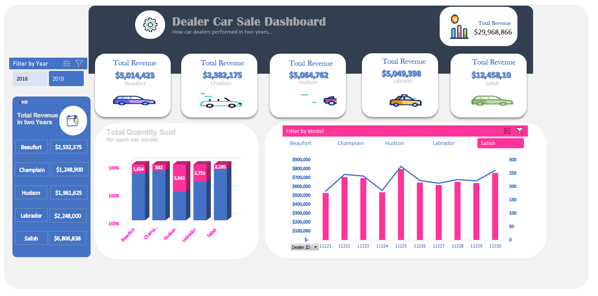

<!--Section 1: Introduce your self-->
## ABOUT ME
<!--To use icon on the github portfolio page, press Windows key + colon-->
Hello! I'm David Yusuf Hassan, a data analyst and educator with a passion for turning data into actionable insights. With experience across sales, operations, finance, and customer service, I help businesses solve challenges and unlock growth.

<!--Mention your top/relevant skills here - core and soft skills-->
## WHAT I DO

*As Data Analyst facilitator at Tech-bridge Integrated Services, I provide consulting and training services for individuals, businesses and mentorship to aspiring analysts.*

**- Data Analytics Consulting.**
I provide in-depth analysis and tailored solutions to help you make data-driven decisions, optimize processes, and drive business growth. 

**- Training & Development.**
I offer comprehensive training programs in data analysis, visualization, and data-driven decision-making. From beginner to advanced levels. 

<!--Section 2: List 3-4 key projects-->
## MY PORTFOLIO 

*A glimpse of some of the projects I've been working on.*

**Analyzing Car Sale and profit for each Dealer**
 

[Read More](https://https://www.linkedin.com/posts/david-yusuf-hassan-62b547224_analysing-car-sales-and-profits-for-each-activity-7292579569117626369-aezp?utm_source=share&utm_medium=member_desktop)

<!--**Predictive Modeling and Hypothesis Testing using Titanic Dataset.** -->

On April 15, 1912, during her maiden voyage, the widely considered “unsinkable” RMS Titanic sank after colliding with an iceberg. 

[Read More](https://www.linkedin.com/pulse/predictive-modeling-hypothesis-testing-using-titanic-dataset-anietie/)

**Predictive Modeling and Hypothesis Testing using Titanic Dataset.**

Unfortunately, there weren’t enough lifeboats for everyone onboard, resulting in the death of 1502 out of 2224 passengers and crew. 

<a href="17 How to Present Data to Executives by Anietie Etuk.pdf">Download the Report here (pdf file)</a>-->

## CONTACT DETAILS

*Let’s connect and see how we can make a difference together!*
<table>
  <tbody>
    <tr>
      <td>📧</td>
      <td><a href="mailto:hassandavidyusuf@gmail.com">hassandavidyusuf@gmail.com</a></td>
    </tr>
    <tr>
      <td>📞</td>
      <td>+2348065060885</td>
    </tr>
    <tr>
      <td>📍</td>
      <td>Jigawa, Nigeria</td>
    </tr>
    <tr>
      <td>⬇️</td>
      <td><a href="https://github.com/Davee36/Portfolio/blob/c6d12ebcd97223912f11ec7cc3972595b19e2781/Resume.pdf">Get my Resume</a></td>
    </tr>
    <tr>
      <td>🌐</td>
      <td><a href="www.linkedin.com/in/david-yusuf-hassan-62b547224">The things I do daily on LinkedIn</a></td>
    </tr>
     <!--<tr>
      <td>📺</td>
     <td><a href="https://www.youtube.com/@LearnwithEtuk">Watch my tutorials on YouTube</a></td> 
    </tr> -->
  </tbody>
</table>
